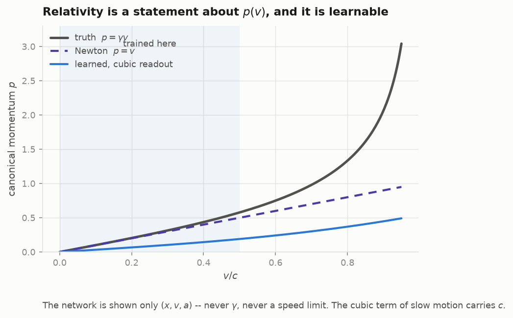
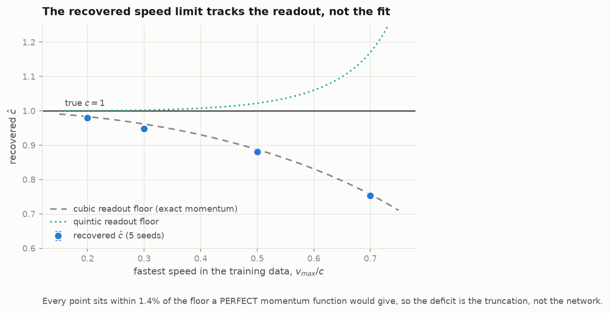
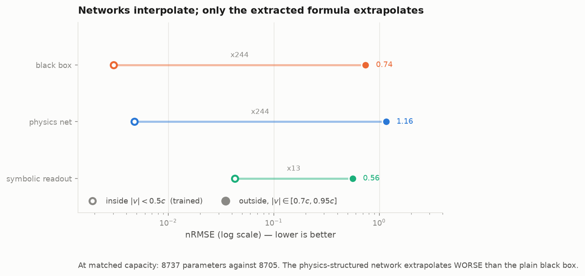

# qphys: quantum formalism as a modeling language

[](https://github.com/drorjac/qphys/actions/workflows/ci.yml)
[](pyproject.toml)
[](LICENSE)
[](https://docs.astral.sh/ruff/)

*Written 2024–2025, released 2026.*

Two different senses of *we do not know what happens next*, built as two
sub-projects that share one set of honesty rules.

| | [`collapse`](docs/collapse) | [`lawlearn`](docs/lawlearn) |
|---|---|---|
| Unknown | the **outcome** | the **law** |
| Known | the dynamical map | some outcomes (data) |
| Formal object | density matrix + Kraus operators | Lagrangian / metric / potential |
| Scored on | out-of-sample NLL at matched capacity | extrapolation outside the training domain |
| Anchor | Seattle daily precipitation | Mercury's orbit |

> **What is never claimed.** No time series here "is quantum". The only claim
> under test is whether a model built from the quantum formalism is more
> efficient than the best classical model **at matched capacity**. That is a
> modelling claim, not a physics claim.

---

## The claims table

First, because **the null result is a deliverable**. If this table ever stops
containing a prominent statement of what was *not* shown, the project has
failed its own rules whatever else it achieved.

| # | Claim | Status |
|---|---|---|
| 1 | A quantum model **predicts** a real series better than the best classical model at matched capacity | **NOT SHOWN: it loses** |
| 2 | Quantum causal states **represent** a process with less memory | **Holds**: it is a theorem, not a fit |
| 3 | A Leggett–Garg violation in a recorded series would be evidence of anything | **FALSE, provably** |
| 4 | The speed limit is recoverable from slow motion alone | **Holds**, 0.2c–0.7c, with a ~40% failure rate |
| 5 | That route works on real orbital data | **FALSE**: Mercury is 1.97e-4 c |

Claims 1 and 2 must never be conflated: a 78% memory saving and a worse test
NLL are both true at once, about different objects. One is an idealised
construction from a known transition matrix; the other is estimation from
finite data.

---

## What the results look like

### Why quantum states could be cheaper, and where it stops


Quantum causal states may be **non-orthogonal**, so they compress below the
classical bound. At `p = 0.5` the two states become predictively identical,
merge, and the classical cost drops discontinuously to zero.

### The failure mode that makes this estimate untrustworthy


Comparing conditional distributions for *float equality* merges nothing, and
the estimate then counts histories instead of structure: **on random bits it
reported 5.5 bits of complexity**. The negative control is what exposed it.
With a two-proportion merge the control collapses to zero and the real data
plateaus.

### The headline negative result


At matched capacity the quantum model loses. The best model on this data is a
**five-parameter HMM**; everything more expensive, classical or quantum, is
worse on average. A single-fit version of this chart had a different winner;
see [why that mattered](docs/FINDINGS.md).

### Why Leggett–Garg proves nothing here


For a passively recorded series with an aligned estimator, `K3 ≤ 1` is an
**algebraic identity**, not an empirical test. A classical Gaussian
oscillator, sign-dichotomised, saturates the bound exactly at every lag. So
`K3` ships here as a unit test on the estimator: above 1 means a windowing
bug.

### Learning the law: relativity is a statement about `p(v)`



The network sees only `(x, v, a)`, never `γ`, never a speed limit. The
speed of light is read out of the cubic term of slow motion.

### What actually limits the answer



The recovered `ĉ` tracks, to within 1.4% at every speed, what a **perfect**
momentum function would give under the same cubic readout. So the deficit
belongs to the readout's truncation, not to the fit, which overturns the
natural reading that the quartic is unidentifiable at low speed.

### Only the formula extrapolates



At matched parameter count, the physics-structured network extrapolates
**worse** than a plain black box. Structure does not make a network
extrapolate; it makes a formula extractable, and the formula extrapolates.

---

## Install and run

```bash
python3.11 -m venv .venv && source .venv/bin/activate
pip install -e '.[dev]'

make test        # fast suite, no training, no network needed
make figures     # regenerate every figure above from results/
make palette     # re-validate the chart colours
make test-all    # everything, including training and seed sweeps
make lint        # ruff + mypy
```

```bash
qphys run collapse    # the Seattle comparison -> results/
qphys run lawlearn    # the c_hat sweeps and extrapolation (hours)
qphys figures         # every figure, from results/
qphys info            # resolved paths; QPHYS_RESULTS_DIR etc. override them
```

`requirements.lock` pins the environment that produced `results/`
(`pip install -e '.[dev]' -c requirements.lock`).

Heavy dependencies are optional extras: `[nn]` for torch, `[baselines]` for
hmmlearn and statsmodels, `[quantum]` for qutip and pysindy. The whole
pipeline runs **with no network**: every loader falls back, and
`Series.is_real` tells you which you got, so a fallback is never silently
substituted for real data.

## Reproducing the results

Every table in `results/` is written by a function under `src/qphys`, and a
test fails if one is not. To regenerate and check them:

```bash
make reproduce     # qphys run all into build/reproduce, then qphys verify
```

`qphys verify` compares the regenerated tables with the committed ones at a
relative tolerance of 1e-9 and exits non-zero on any difference.
`results/environment.json` records the commit, package versions and whether
the loaders were forced offline for the run that wrote it.

| command | wall time (M2, macOS 13.4, CPU) | needs |
|---|---|---|
| `qphys run collapse` | 24 min | the Seattle series; cached in `data/raw/` after the first download |
| `qphys run lawlearn` | hours (not re-timed) | nothing external; simulation only |

`qphys run collapse` was last re-run on 2026-09-26: `seattle_table.csv` and
`seattle_memory.json` reproduced byte for byte.

## Layout

```text
src/qphys/
  config.py        resolved paths, each overridable (QPHYS_RESULTS_DIR, ...)
  cli.py           the `qphys` console script
  common/          seeding · units · metrics · plotting · palette · figures
  collapse/        kraus · causal_states · leggett_garg · processes
                   baselines · data · experiments
  lawlearn/        relativistic · orbit · lawnet · experiments
tests/             every claim above, as a test that fails when it stops being true
results/           generated tables, never typed by hand, each written by code
figures/           generated by `make figures`
docs/
  collapse/        the outcome is unknown: Kraus, causal states, Leggett-Garg
  lawlearn/        the law is unknown: momentum network, readout, extrapolation
  FINDINGS.md      the numbers behind the pictures
  HYPOTHESES.md    each claim, what would refute it, the test that guards it
  DECISIONS.md     what was decided, against what, and why
  RELATED_WORK.md  where this sits in the literature (references.bib)
```

Each topic folder carries its figures beside the text that explains them, and
the correction each result needed before it meant anything. Start at
[`docs/`](docs).

**Natural units inside, physical units only at the reporting boundary.** In
SI, `c² ≈ 9e16` and the loss surface is unusable; orbits use AU and years for
the same reason.

Logic lives in `src/`. A notebook imports it and is never the source of truth.

## The rules

Seven of them, binding, in [docs/CONTRIBUTING.md](docs/CONTRIBUTING.md). The short
version: never claim a series is quantum; the null result is a deliverable;
match capacity, not state count; temporal splits declared up front; verify
rather than assert; at least five seeds with the failure rate reported; and
convergence criteria pre-declared on training loss, never on the answer.

Rule 6 has already paid for itself: one HQMM fit scored 0.8464 and appeared
to overturn the headline, while the same configuration over five seeds
averages 0.8785 ± 0.0267.

## Environment

Verified on Python 3.11.5 with numpy 2.4.6, scipy 1.17.1, pandas 3.0.6,
torch 2.11.0, qutip 5.3.1, pysindy 2.1.0, hmmlearn 0.3.3. Install `torch`
from default PyPI; `download.pytorch.org` has been seen to return 403
through a proxy, so no index is hardcoded here.

## Reading

Gu, Wiesner, Rieper & Vedral, *Nat. Commun.* **3**:762 (2012) · Srinivasan,
Gordon & Boots, AISTATS 2018 · Monras, Beige & Wiesner (2011) · Crutchfield &
Young (1989); Shalizi & Shalizi, UAI 2004 (CSSR) · Emary, Lambert & Nori, *Rep. Prog. Phys.*
**77** (2014) · Cranmer et al. (2020) · Greydanus, Dzamba & Yosinski (2019) ·
Raissi, Perdikaris & Karniadakis, *JCP* **378** (2019).
What this project adds to each: [`docs/RELATED_WORK.md`](docs/RELATED_WORK.md).

**Sibling project.** [`physics-prior`](https://github.com/drorjac/physics-prior)
measures what a *known* law's prior is worth to a learner, on LIGO, NIST,
COBE and JPL data. Both touch Mercury; they ask different questions and are
kept separate on purpose ([`docs/DECISIONS.md`](docs/DECISIONS.md)).

Cite as in [`CITATION.cff`](CITATION.cff).

Licensed under the [MIT License](LICENSE).
