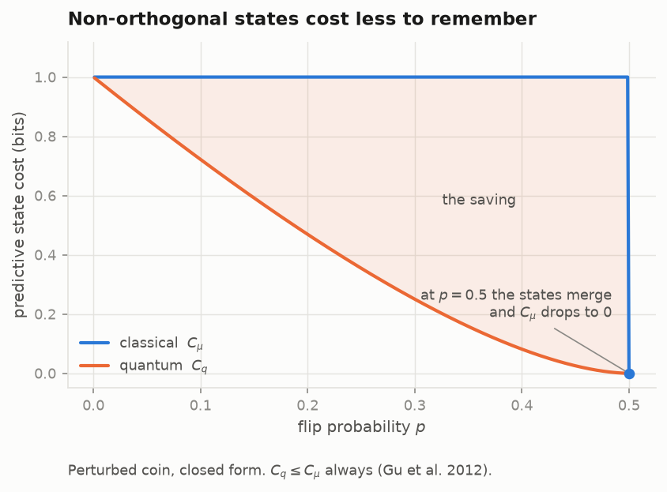
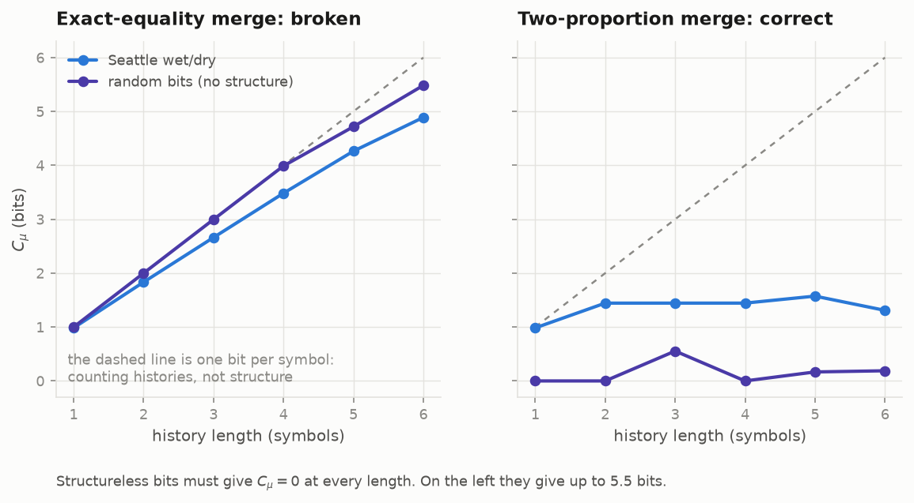
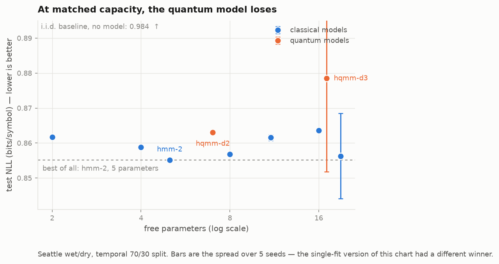
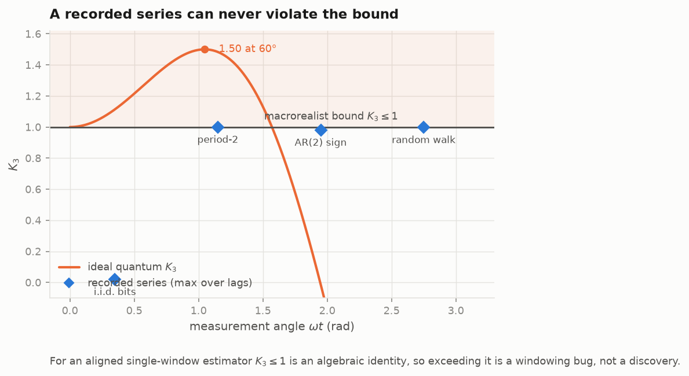

# collapse: time series as sequences of measurement collapses

A classical HMM carries a probability vector. An HQMM carries a **density
matrix**, and observing symbol `x` applies a Kraus operator and renormalises,
so the observation *is* the collapse:

```
rho -> K_x rho K_x^dag / p(x),   p(x) = tr(K_x rho K_x^dag),   sum_x K_x^dag K_x = I
```

Code: [`src/qphys/collapse`](../../src/qphys/collapse) ·
Tables: [`results/`](../../results)

> **What is never claimed.** No series here "is quantum". The claim under
> test is whether this model is more efficient than the best classical model
> **at matched capacity**.

---

## Why quantum states could be cheaper



Quantum causal states may be **non-orthogonal**, so they compress below the
classical bound: `C_q ≤ C_mu` always, strictly for almost every non-trivial
process (Gu, Wiesner, Rieper & Vedral, *Nat. Commun.* **3**:762, 2012).

The `p = 0.5` point is a required regression test rather than a curiosity.
There the output is i.i.d., the two causal states become predictively
identical and **merge**, so `C_mu` drops discontinuously to 0, not to 1. An
epsilon-machine returning 1 bit there has no state merging.

## The failure mode that makes this estimate untrustworthy



Two conditional distributions estimated from finite counts are **never
exactly equal**, so a float-equality merge merges nothing, and the estimate
counts histories instead of structure. On Mersenne-Twister bits (no
structure by construction), `C_mu` climbed to **5.5 bits**.

The negative control is what exposed it. With a two-proportion test at 2.5σ,
as CSSR makes, the control collapses to ~0 at every length and the real data
plateaus:

| order | states | `C_mu` | `C_q` |
|---|---|---|---|
| 1 | 2 | 0.984 | 0.276 |
| 2–4 | 3 | 1.444 | 0.310 |

So Seattle carries about **1.44 bits** of classical predictive state, not the
0.98 that order 1 alone suggests, and the quantum saving at the plateau is
**78.5%** rather than 71.9%. Both numbers are defensible about different
objects: one describes the first-order *model*, the other the process as far
as 1461 days can show it.

## The headline negative result



**At matched capacity the quantum model loses.** The best model on Seattle
daily wet/dry is a five-parameter HMM; everything more expensive, classical
or quantum, is worse on average.

Two fixes were needed before that sentence was safe to write:

**The classical side was under-tuned.** Without random restarts the HMM at
`k = 2` and `k = 3` converges to a degenerate single-emission solution and
returns exactly the i.i.d. NLL. With restarts they reach 0.855 and 0.862,
which makes the baseline *stronger*, the direction that matters.

**A single fit nearly produced a false reversal.** One `hqmm-d3` fit scored
0.8464, which at 17 free parameters beats every classical model costing 17 or
fewer; being beaten only by a *19*-parameter HMM is not a matched-capacity
comparison. Over five seeds the same configuration averages
**0.8785 ± 0.0267** while `hmm-2` sits at **0.8551 ± 0.000009**. The 0.8464
was the favourable tail of a wide distribution.

## Why Leggett–Garg proves nothing here



For a passively recorded series with all three correlators estimated from one
aligned window, every bracket is `≤ 1` by exhaustive enumeration, so
**`K3 ≤ 1` is an algebraic identity, not an empirical test**. A recorded
series satisfies macrorealism by construction: every value is definite and
stored.

Worse, a classical Gaussian process with `r(τ) = cos(ωτ)`, sign-dichotomised,
has correlator `(2/π)·arcsin(r)` by the Van Vleck law, a triangle wave that
**saturates `K3 = 1` exactly at every lag**. A classical oscillator imitates
the quantum shape maximally.

So `K3` ships here as a **unit test on the estimator**. If it ever returns
above 1, there is a windowing bug.
